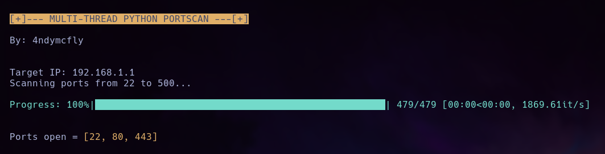

# scannerip_mt
### A multi-thread python IPv4 port scanner.



Usage:
```
./scannerip_mt.py <ip_address> <startPort> <endPort>
```
Or
```
python3 scannerip_mt.py <ip_address> <startPort> <endPort>
```
Example:
```
./scannerip_mt.py 192.168.1.1 22 500
```
Assign execute permissions before use:
```
chmod +x scannerip_mt.py
```
